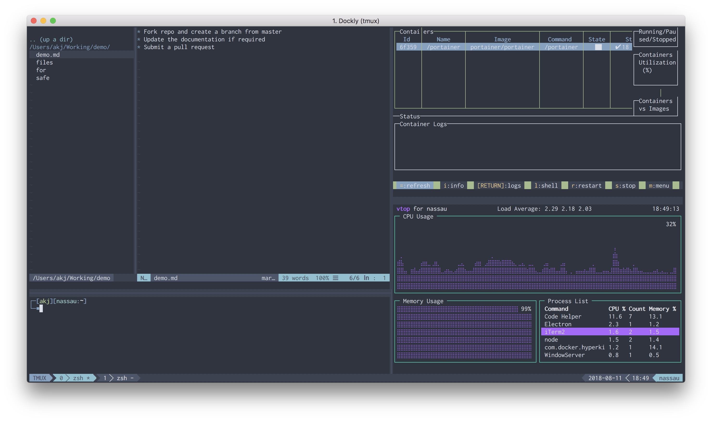
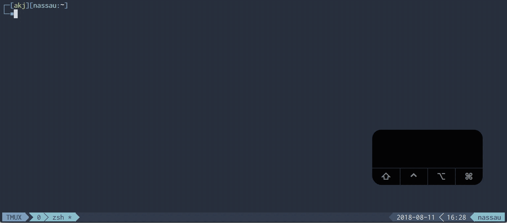

## Overview
Noobs Terminal is a single-command installer that incorporates some of the wonderful terminal programs, packages, and configurations that are commonly installed together.  

Special thanks to all of the contributors and creators of the tools and configurations included.

## What's Included
| Feature | Description |
| --- | --- |
| [zsh](https://en.wikipedia.org/wiki/Z_shell) | a popular shell with features like completion, path correction, spelling correction, and more |
| [tmux](https://github.com/tmux/tmux) | terminal muxiplier allows you to manage multiple terminal sessions from a single window |
| [neovim](https://neovim.io/) | a project that seeks to aggressively refactor Vim |
| [oh-my-zsh](https://github.com/robbyrussell/oh-my-zsh) | a framework for managing your zsh configuration |
| [vim-sensible](https://github.com/tpope/vim-sensible) | vim settings everyone can agree on  
| [tmux-sensible](https://github.com/tmux-plugins/tmux-sensible) | tmux settings everyone can agree on |
| [nord-tmux](https://github.com/arcticicestudio/nord-tmux) | An arctic, north-bluish clean and elegant tmux color theme |
| [nord-vim](https://github.com/arcticicestudio/nord-vim) | An arctic, north-bluish clean and elegant Vim color theme 
| [imp](https://github.com/aaronkjones/Imp) | My modified Imp theme by [igormp](https://github.com/igormp/Imp) | 

## Features
* Auto-completion
* Auto-suggestion
* Command validation
* Spell correction
* Themes
* Directory history
* Git feedback
* Aliases
* Terminal multiplexing
* Persistance
* Split windows

## Resources
* [Awesome Tmux](https://github.com/rothgar/awesome-tmux)  
* [Awesome Vim](https://github.com/akrawchyk/awesome-vim)  
* [VimAwesome](https://vimawesome.com)  
* [Awesome Zsh](https://github.com/unixorn/awesome-zsh-plugins)  

## Demo
If you want to "try before you buy", you can use Vagrant to spin up a VM.

### Install Virtualbox
[Virtualbox Downloads](https://www.virtualbox.org/wiki/Downloads)  
### Install Vagrant
[Vagrant Downloads](https://www.vagrantup.com/downloads.html)
### Initialize a Vagrantfile for Ubuntu 18.04
`vagrant init peru/ubuntu-18.04-desktop-amd64 --box-version 20180801.01`  
### Start Your Ubuntu VM
`vagrant up`  

In Virtualbox, click the "Show" button. You can now run the install command below in a destructible environment.

## Install
To install, run this command in your terminal:  

`sh -c "$(wget -q https://raw.githubusercontent.com/aaronkjones/noobs-term/master/noobs-term.sh -O -)"`  

If you do not have wget use,

`sh -c "$(curl -fsSL https://raw.githubusercontent.com/aaronkjones/noobs-term/master/noobs-term.sh)"`

## Supported Platforms
Currently the following platforms are confirmed to be supported
* Ubuntu
* macOS
* Arch Linux

## Setup
> Note: You will have to log out and back in for Zsh to be set as the default shell. If you don't want to log out, enter *zsh*.

### Ubuntu

* Press *Ctrl* + *a*, then *I* to load Tmux plugins
* In Gnome Terminal preferences, set Nord as your default profile
* Set an appropriate font (e.g. Inconsolata for Powerline)

### OSX

* Press *Ctrl* + *a*, then *I* to load Tmux plugins
* In iTerm, set your color profile to Nord
* Set an appropriate font (e.g. Inconsolata for Powerline)

### Arch Linux

* Press *Ctrl* + *a*, then *I* to load Tmux plugins
* In Gnome Terminal preferences, set Nord as your default profile
* Set an appropriate font (e.g. Inconsolata for Powerline)

## Contributing
Please read [CONTRIBUTING.md](https://github.com/aaronkjones/noobs-term/blob/master/CONTRIBUTING.md). 