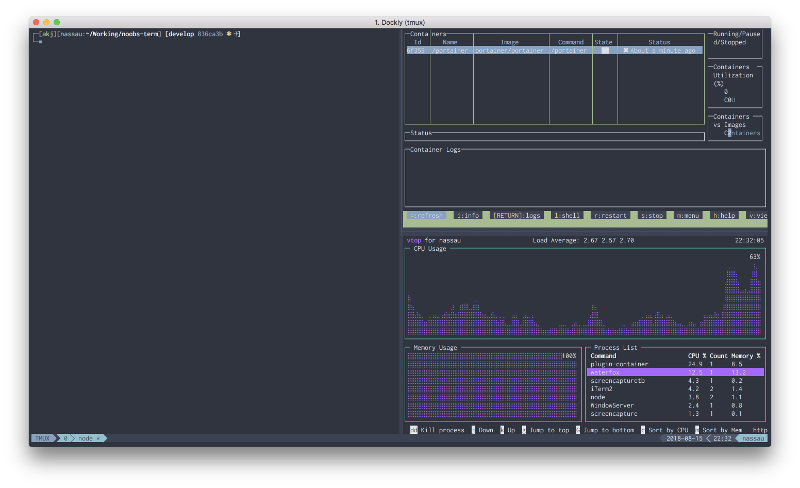

# noobs-term

[](https://www.codacy.com/app/aaronkjones/noobs-term?utm_source=github.com&utm_medium=referral&utm_content=aaronkjones/noobs-term&utm_campaign=Badge_Grade)
[](https://github.com/aaronkjones/noobs-term/blob/master/LICENSE)
[](https://twitter.com/intent/tweet?url=http://noobs-term.com&text=A%20terminal%20bundle%20for%20everyone&hashtags=tmux,zsh,command-line)

<!-- START doctoc generated TOC please keep comment here to allow auto update -->

<!-- DON'T EDIT THIS SECTION, INSTEAD RE-RUN doctoc TO UPDATE -->

-   [Overview](#overview)
-   [What's Included](#whats-included)
-   [Showcase](#showcase)
    -   [Completions](#completions)
    -   [Auto-suggestions](#auto-suggestions)
    -   [Command validation](#command-validation)
    -   [Directory history](#directory-history)
    -   [Git feedback](#git-feedback)
    -   [Terminal multiplexing](#terminal-multiplexing)
    -   [Window tabbing](#window-tabbing)
    -   [Nord theming](#nord-theming)
    -   [Persistence](#persistence)
-   [Demo](#demo)
-   [Supported Platforms](#supported-platforms)
-   [Install](#install)
-   [Setup](#setup)
    -   [Ubuntu](#ubuntu)
    -   [OSX](#osx)
    -   [Arch](#arch)
    -   [Windows](#windows)
-   [Uninstall](#uninstall)
-   [Resources](#resources)
-   [Contributing](#contributing)

<!-- END doctoc generated TOC please keep comment here to allow auto update -->

## Overview

  
Noobs Terminal is a terminal bundle that incorporates some of the wonderful terminal programs, packages, and configurations that are commonly installed together.

## What's Included

| Feature                                                             | Description                                                                                   |
| ------------------------------------------------------------------- | --------------------------------------------------------------------------------------------- |
| [zsh](https://en.wikipedia.org/wiki/Z_shell)                        | a popular shell with features like completion, path correction, spelling correction, and more |
| [tmux](https://github.com/tmux/tmux)                                | terminal muxiplier allows you to manage multiple terminal sessions from a single window       |
| [neovim](https://neovim.io/)                                        | a project that seeks to aggressively refactor Vim                                             |
| [oh-my-zsh](https://github.com/robbyrussell/oh-my-zsh)              | a framework for managing your zsh configuration                                               |
| [vim-sensible](https://github.com/tpope/vim-sensible)               | vim settings everyone can agree on                                                            |
| [tmux-sensible](https://github.com/tmux-plugins/tmux-sensible)      | tmux settings everyone can agree on                                                           |
| [nord-tmux](https://github.com/arcticicestudio/nord-tmux)           | An arctic, north-bluish clean and elegant tmux color theme                                    |
| [nord-vim](https://github.com/arcticicestudio/nord-vim)             | An arctic, north-bluish clean and elegant Vim color theme                                     |
| [spaceship-prompt](https://github.com/denysdovhan/spaceship-prompt) | A Zsh prompt for Astronauts                                                                   |

## Showcase

### Completions


Completion scripts for [many](https://github.com/zsh-users/zsh-completions/tree/master/src) programs.

### Auto-suggestions

Auto-suggestions based on command history


### Command validation

Real-time command validation


### Directory history

Quick directory switching based on command history


### Git feedback

Real-time Git feedback


### Terminal multiplexing

Tmux terminal multiplexing. Split windows horizontally and vertically.


### Window tabbing

Create many terminal sessions in a single window


### Nord theming

Beautiful arctic bluish Nord theming for Tmux, iTerm, Gnome-terminal, and Neovim.


### Persistence

Session persistence across connection drops, reboots, and accidental closing.


## Demo

If you want to "try before you buy", you can use Vagrant to spin up a VM.

1.  Install Virtualbox  
    [Virtualbox Downloads](https://www.virtualbox.org/wiki/Downloads)
2.  Install Vagrant  
    [Vagrant Downloads](https://www.vagrantup.com/downloads.html)
3.  Initialize a Vagrantfile for Ubuntu 18.04  
    `vagrant init peru/ubuntu-18.04-desktop-amd64 --box-version 20180801.01`
4.  Start Your Ubuntu VM  
    `vagrant up`

In Virtualbox, click the "Show" button. You can now run the install command below in a destructible environment.

## Supported Platforms

Currently the following platforms are confirmed to be supported

-   Ubuntu
-   macOS
-   Arch Linux
-   Windows
-   Raspbian

## Install

The installer will perform several functions including:

-   Install dependencies: git, curl, wget, zsh, tmux, neovim
-   Install dotfiles to `~/.dotfiles` and symbolically link them to their default locations
-   Set default shell to Zsh
-   Load Neovim plugins
-   Install plugins and themes

To install, run the following commands in your terminal:

```bash
git clone https://github.com/aaronkjones/noobs-term.git
cd noobs-term
chmod +x noobs-term.sh
sh noobs-term.sh
```

Single command install:

`sh -c "$(wget -q https://raw.githubusercontent.com/aaronkjones/noobs-term/master/noobs-term.sh -O -)"`  
or  
`sh -c "$(curl -fsSL https://raw.githubusercontent.com/aaronkjones/noobs-term/master/noobs-term.sh)"`

## Setup

> Note: You will have to log out and back in for Zsh to be set as the default shell. If you don't want to log out, enter _zsh_.

### Ubuntu

1.  Press <kbd>Ctrl</kbd> + <kbd>a</kbd>, then <kbd>I</kbd> to load tmux plugins
2.  In Gnome Terminal preferences, set Nord as your default profile
3.  Set an appropriate font (e.g. Inconsolata for Powerline)

### OSX

1.  Press <kbd>Ctrl</kbd> + <kbd>a</kbd>, then <kbd>I</kbd> to load tmux plugins
2.  In iTerm, set your color profile to Nord
3.  Set an appropriate font (e.g. Inconsolata for Powerline)

### Arch

1.  Press <kbd>Ctrl</kbd> + <kbd>a</kbd>, then <kbd>I</kbd> to load tmux plugins
2.  In Gnome Terminal preferences, set Nord as your default profile
3.  Set an appropriate font (e.g. Inconsolata for Powerline)

### Windows

1.  Enable WSL  
    In Powershell (as Admin):  
    `Enable-WindowsOptionalFeature -Online -FeatureName Microsoft-Windows-Subsystem-Linux`
2.  Install Ubuntu 18.04  
    From the Windows Store, search for Ubuntu 18.04

3.  Install Chocolatey  
    In Powershell (as Admin):  
    `Set-ExecutionPolicy Bypass -Scope Process -Force; Invoke-Expression ((New-Object System.Net.WebClient).DownloadString('https://chocolatey.org/install.ps1'))`

4.  Install Hyper  
    In Powershell (as Admin):  
    `choco install -y hyper`

5.  Install Font  
    Download Inconsolata (or your preferred font), open, and click "Install"
    `https://github.com/powerline/fonts/raw/master/Inconsolata/Inconsolata%20for%20Powerline.otf`

    > To install all Powerline fonts, clone the repo `https://github.com/powerline/fonts.git` and run install.ps1

6.  Set shell to wsl.exe  
    In Hyper:  
    `chsh -s $(which zsh)`  
    In preferences (<kbd>Ctrl</kbd> + <kbd>,<kbd>), find and change shell and font settings to:

    ```powershell
    shell: 'C:\\Windows\\System32\\wsl.exe',
    shellArgs: [],
    fontFamily: 'Inconsolata for Powerline',
    ```

    > If you want, you can add the font to the beginning to retain fallback fonts (e.g. fontFamily: 'Inconsolata for Powerline','monospace',...)

7.  Install Nord-Hyper  
    In Powershell (as Admin):  
    `hyper -i nord-hyper`

8.  Run Noobs-Term installer

## Uninstall

The uninstaller allows you to remove installed dotfiles, restore backed up dotfiles, and selectively remove installed plugins.

To uninstall, run this command in your terminal:

```bash
git clone https://github.com/aaronkjones/noobs-term.git
cd noobs-term
chmod +x noobs-term-uninstall.sh)"
sh noobs-term-uninstall.sh
```

Single command uninstall:

`sh -c "$(wget -q https://raw.githubusercontent.com/aaronkjones/noobs-term/master/noobs-term-uninstall.sh -O -)"`  
or  
`sh -c "$(curl -fsSL https://raw.githubusercontent.com/aaronkjones/noobs-term/master/noobs-term-uninstall.sh)"`

## Resources

-   [Awesome Tmux](https://github.com/rothgar/awesome-tmux)
-   [Awesome Vim](https://github.com/akrawchyk/awesome-vim)
-   [VimAwesome](https://vimawesome.com)
-   [Awesome Zsh](https://github.com/unixorn/awesome-zsh-plugins)

## Contributing

Please read [CONTRIBUTING.md](https://github.com/aaronkjones/noobs-term/blob/master/CONTRIBUTING.md).
