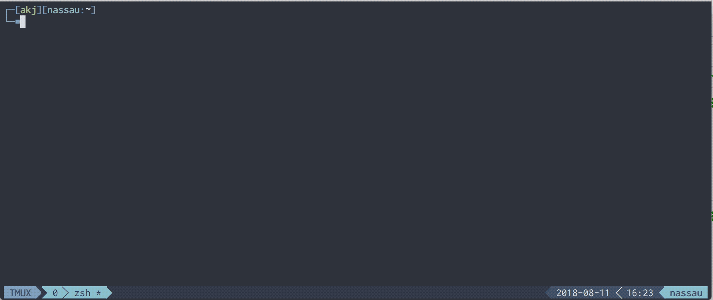

## Overview
  
Noobs Terminal is a single-command installer that incorporates some of the wonderful terminal programs, packages, and configurations that are commonly installed together.   

**Special thanks to all of the contributors and creators of the tools and configurations included.**

[](https://github.com/aaronkjones/noobs-term/)

## What's Included
| Feature | Description |
| --- | --- |
| [zsh](https://en.wikipedia.org/wiki/Z_shell) | a popular shell with features like completion, path correction, spelling correction, and more |
| [tmux](https://github.com/tmux/tmux) | terminal muxiplier allows you to manage multiple terminal sessions from a single window |
| [neovim](https://neovim.io/) | a project that seeks to aggressively refactor Vim |
| [oh-my-zsh](https://github.com/robbyrussell/oh-my-zsh) | a framework for managing your zsh configuration |
| [vim-sensible](https://github.com/tpope/vim-sensible) | vim settings everyone can agree on  
| [tmux-sensible](https://github.com/tmux-plugins/tmux-sensible) | tmux settings everyone can agree on |
| [nord-tmux](https://github.com/arcticicestudio/nord-tmux) | An arctic, north-bluish clean and elegant tmux color theme |
| [nord-vim](https://github.com/arcticicestudio/nord-vim) | An arctic, north-bluish clean and elegant Vim color theme 
| [imp](https://github.com/aaronkjones/Imp) | My modified Imp theme by [igormp](https://github.com/igormp/Imp) | 

## Features
* Auto-completion
* Auto-suggestion
* Command validation
* Spell correction
* Themes
* Directory history
* Git feedback
* Aliases
* Terminal multiplexing
* Persistance
* Split windows



## Resources
* [Awesome Tmux](https://github.com/rothgar/awesome-tmux)  
* [Awesome Vim](https://github.com/akrawchyk/awesome-vim)  
* [VimAwesome](https://vimawesome.com)  
* [Awesome Zsh](https://github.com/unixorn/awesome-zsh-plugins)  

## Demo
If you want to "try before you buy", you can use Vagrant to spin up a VM.

1. Install Virtualbox  
[Virtualbox Downloads](https://www.virtualbox.org/wiki/Downloads)  
2. Install Vagrant  
[Vagrant Downloads](https://www.vagrantup.com/downloads.html)  
3. Initialize a Vagrantfile for Ubuntu 18.04  
```vagrant init peru/ubuntu-18.04-desktop-amd64 --box-version 20180801.01```  
4. Start Your Ubuntu VM  
```vagrant up```  

In Virtualbox, click the "Show" button. You can now run the install command below in a destructible environment.

## Supported Platforms
Currently the following platforms are confirmed to be supported
* Ubuntu
* macOS
* Arch Linux
* Windows

## Install
The installer will perform several functions including:
* Install dependencies: git, curl, wget, zsh, tmux, neovim  
* Install dotfiles to `~/.dotfiles` and symbolically link them to their default locations  
* Set default shell to Zsh  
* Load Neovim plugins  
* Install plugins and themes  

To install, run the following in your terminal:  
```
curl -O https://raw.githubusercontent.com/aaronkjones/noobs-term/master/noobs-term.sh
chmod +x noobs-term.sh
./noobs-term.sh
rm noobs-term.sh
```  

## Setup
> Note: You will have to log out and back in for Zsh to be set as the default shell. If you don't want to log out, enter *zsh*.

### Ubuntu

1. Press *Ctrl* + *a*, then *I* to load Tmux plugins
2. In Gnome Terminal preferences, set Nord as your default profile
3. Set an appropriate font (e.g. Inconsolata for Powerline)

### OSX

1. Press *Ctrl* + *a*, then *I* to load Tmux plugins
2. In iTerm, set your color profile to Nord
3. Set an appropriate font (e.g. Inconsolata for Powerline)

### Arch Linux

1. Press *Ctrl* + *a*, then *I* to load Tmux plugins
2. In Gnome Terminal preferences, set Nord as your default profile
3. Set an appropriate font (e.g. Inconsolata for Powerline)

### Windows
1. Enable WSL  
In Powershell (as Admin):  
```Enable-WindowsOptionalFeature -Online -FeatureName Microsoft-Windows-Subsystem-Linux```
2. Install Ubuntu 18.04  
From the Windows Store, search for Ubuntu 18.04

3. Install Chocolatey  
In Powershell (as Admin):  
```Set-ExecutionPolicy Bypass -Scope Process -Force; Invoke-Expression ((New-Object System.Net.WebClient).DownloadString('https://chocolatey.org/install.ps1'))```  

4. Install Hyper  
In Powershell (as Admin):  
```choco install -y hyper```

5. Install Font  
Download Inconsolata (or your preferred font), open, and click "Install"
```https://github.com/powerline/fonts/raw/master/Inconsolata/Inconsolata%20for%20Powerline.otf```  
> To install all Powerline fonts, clone the repo ```https://github.com/powerline/fonts.git``` and run install.ps1

6. Set shell to wsl.exe  
In Hyper:  
```chsh -s $(which zsh)```  
In preferences (Ctrl+comma), find and change shell and font settings to:
```
shell: 'C:\\Windows\\System32\\wsl.exe',
shellArgs: [],
fontFamily: 'Inconsolata for Powerline',
```
> If you want, you can add the font to the beginning to retain fallback fonts (e.g. fontFamily: 'Inconsolata for Powerline','monospace',...)

7. Install Nord-Hyper  
In Powershell (as Admin):  
```hyper -i nord-hyper```

8. Run Noobs-Term installer  
```sh -c "$(wget -q https://raw.githubusercontent.com/aaronkjones/noobs-term/master/noobs-term.sh -O -)"``` 

## Uninstall
The uninstaller allows you to remove installed dotfiles, restore backed up dotfiles, and selectively remove installed plugins.  

To uninstall, run this command in your terminal:  
```sh -c "$(curl -fsSL https://raw.githubusercontent.com/aaronkjones/noobs-term/master/noobs-term-uninstall.sh)"```

## Contributing
Please read [CONTRIBUTING.md](https://github.com/aaronkjones/noobs-term/blob/master/CONTRIBUTING.md). 